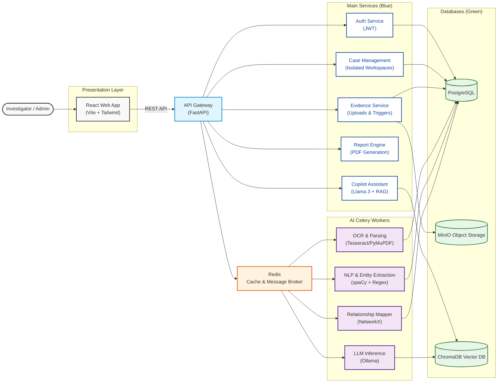

# Architecture — Investigation Intelligence Platform

## High-Level Design (HLD)



## Low-Level Design (LLD) - Data Processing Flow

```mermaid
flowchart TD
    classDef start fill:#e1f5fe,stroke:#0288d1,stroke-width:2px;
    classDef process fill:#ffffff,stroke:#0d47a1,stroke-width:2px;
    classDef storage fill:#e8f5e9,stroke:#2e7d32,stroke-width:2px,shape:cylinder;
    
    Start((Evidence Upload)):::start --> SaveS3[Upload to MinIO Storage]:::process
    SaveS3 --> MinIO[(MinIO)]:::storage
    SaveS3 --> CreateDB[Create DB Record: PENDING]:::process
    CreateDB --> PG[(Postgres)]:::storage
    CreateDB --> TriggerQueue[Dispatch to Celery Queue]:::process
    
    TriggerQueue --> |evidence_processing| OCRTask[OCR & Extraction Task]:::process
    
    OCRTask --> HasText{Text Extracted?}
    HasText -->|Yes| NLPTask[NLP Task\n(spaCy NER)]:::process
    HasText -->|No| FailTask[Mark Record Failed]:::process
    
    NLPTask --> ExtractEntities[Extract Persons, Phones, Orgs, Money]:::process
    ExtractEntities --> EmbeddingTask[Embeddings Task\n(Sentence Transformers)]:::process
    EmbeddingTask --> Chroma[(ChromaDB)]:::storage
    
    ExtractEntities --> TimelineTask[Timeline Extraction Task]:::process
    TimelineTask --> GraphTask[Relationship Graphing Task]:::process
    
    GraphTask --> ThreatScoring[Calculate Threat Score\n(Financial + Comms)]:::process
    ThreatScoring --> MatchGlobal[Compute Global Cross-Case Links]:::process
    MatchGlobal --> MarkComplete[Update DB Record: COMPLETED]:::process
    MarkComplete --> PG
```

## Key Design Patterns

| Pattern | Implementation |
|---------|---------------|
| Repository Pattern | `BaseRepository[T]` generic base class |
| Service Layer | Business logic isolated from routers |
| DTOs | Pydantic v2 schemas for all API contracts |
| Dependency Injection | FastAPI `Depends()` for DB, auth, storage |
| Task Queue | Celery with named queues and retry logic |
| Graceful Degradation | Ollama fallback to rule-based responses |
| Storage Abstraction | `StorageService` wraps MinIO with retry |
| Async/Sync Bridge | Async FastAPI ↔ Sync Celery via DB |

## Technology Justifications

| Technology | Why |
|-----------|-----|
| FastAPI | Async Python, auto OpenAPI, Pydantic v2 |
| PostgreSQL | JSONB for flexible metadata, full ACID |
| Celery + Redis | Battle-tested async task processing |
| MinIO | S3-compatible, self-hosted, scalable |
| ChromaDB | Purpose-built for embeddings + similarity |
| Ollama | Local LLM inference, no API costs |
| Sentence Transformers | Lightweight, CPU-friendly embeddings |
| spaCy | Production NLP, fastest NER available |
| React + Vite | Fast development, TypeScript-first |
| Tailwind | Design system in code, no CSS files |
