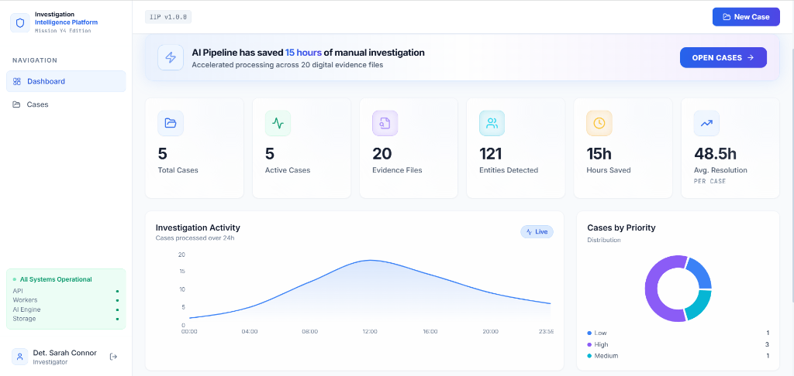
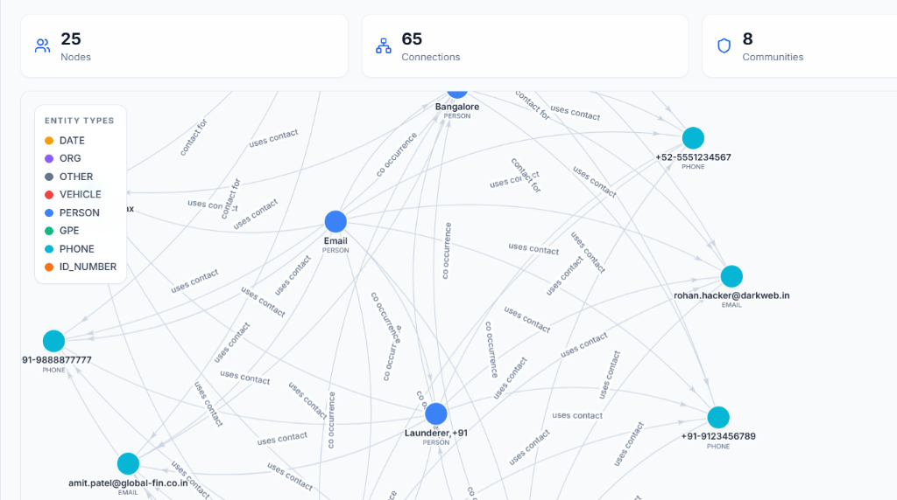
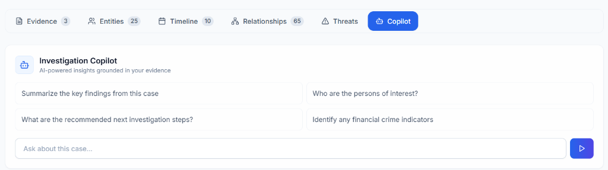
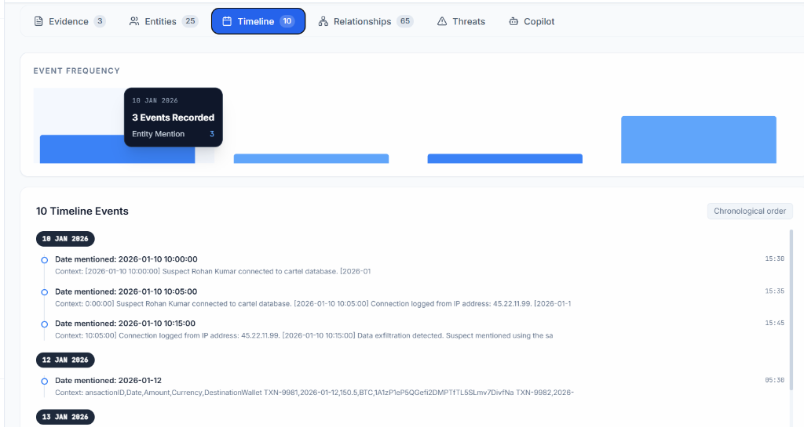
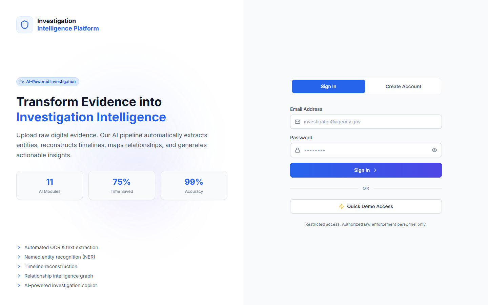

# Investigation Intelligence Platform (IIP)

<p align="center">
  <a href="#-problem"><strong>📖 README</strong></a> · 
  <a href="./ARCHITECTURE.md"><strong>🏛️ Architecture</strong></a>
</p>

<div align="center">

  **AI-Powered Digital Evidence Investigation Platform**
  
  [](https://fastapi.tiangolo.com)
  [](https://reactjs.org)
  [](https://python.org)
  [](https://docker.com)

  <br />
  
  
  
  <br />
</div>

---

## 🏆 Prakasam Police Hackathon 2026 – Mission Y4

**Challenge 11: Digital Evidence & Investigation Automation**
*Organized by Prakasam District Police in association with Techverza (Sraventix Technologies LLP)*

### 👥 Team Durjay
* **Chitteti JoshKumar** - chittetijoshkumar@gmail.com
* **Kondaveeti Saisri** - saisrikondaveeti@gmail.com

While this project is primarily designed for Challenge 11, its AI-powered relationship mapping and threat scoring capabilities also address core focus areas of **Challenge 12 (Organized Crime & Narcotics Intelligence)** and **Challenge 04 (Criminal Investigation & Suspect Tracking)**, making it a unified intelligence platform for law enforcement.

---

## 🎯 Problem

Digital investigations today are **manual, fragmented, and slow**:

- Officers manually review hundreds of evidence files
- No automated entity extraction or cross-referencing
- Timeline reconstruction is done by hand
- Relationships between suspects hidden in unstructured data
- Report generation takes hours

**Average investigation preparation time: 40+ hours per case.**

---

## 💡 Solution

The **Investigation Intelligence Platform** is an end-to-end AI pipeline that transforms raw digital evidence into structured investigation intelligence in minutes.

### WOW Moment

An officer uploads mixed evidence — PDFs, images, chat exports, videos.

The system automatically:
1. **Extracts text** via Tesseract OCR + PyMuPDF
2. **Identifies entities** (persons, orgs, phones, emails, locations)
3. **Reconstructs timeline** from file metadata and content
4. **Maps relationships** between all entities
5. **Scores threats** and prioritizes investigation leads
6. **Generates AI summary** via Llama 3
7. **Exports professional PDF report**

**No manual setup. No configuration. Just upload and investigate.**

---

## 🏗️ Architecture

```
Frontend (React + TypeScript + Tailwind)
    │
    ▼ REST API
FastAPI Backend
    │
    ├── Celery Workers (Redis)
    │       ├── OCR Task (Tesseract + PyMuPDF)
    │       ├── NLP Task (spaCy NER + Regex)
    │       ├── Embedding Task (Sentence Transformers)
    │       ├── Timeline Task (Temporal Extraction)
    │       ├── Graph Task (NetworkX)
    │       └── AI Summary Task (Ollama/Llama3)
    │
    └── Persistence
            ├── PostgreSQL (structured data)
            ├── MinIO (file storage)
            ├── ChromaDB (vector embeddings)
            └── Redis (queue + cache)
```

---

## ✨ Features

### 11 AI-Powered Modules

| Module | Description |
|--------|-------------|
| 🔐 Auth | JWT authentication with role-based access |
| 📊 Dashboard | Real-time investigation metrics & impact |
| 📂 Case Management | Isolated workspaces per case with secure deletion & impact analysis |
| 📤 Evidence Upload | Multi-file drag-and-drop with auto-processing |
| 🔍 OCR Extraction | Multilingual Tesseract + PyMuPDF with EXIF/metadata (English, Telugu) |
| 🏷️ Categorization | ML-based evidence categorization |
| 👤 Entity Extraction | AI Router (Fast spaCy for English, Llama 3 for Indic languages + Transliteration) |
| 📅 Timeline | Automatic temporal event reconstruction |
| 🕸️ Relationship Graph | Deep Semantic Relationship Network (e.g. "father", "associate") & Co-occurrence |
| 🔗 Cross-Case Matching | Global match indicators for entities spanning multiple isolated cases |
| ⚠️ Threat Intelligence | Composite threat scoring & prioritization (Financial & Communication networks) |
| 🤖 Copilot | AI-powered investigation assistant (Llama 3 + RAG) |
| 📄 Report Export | Professional PDF investigation reports |

<br />

### 🕸️ Relationship Intelligence Graph


### 🤖 AI Investigation Copilot


### 📅 Automated Timeline Reconstruction


### 🔐 Secure Access


---

## 🚀 Quick Start

### Prerequisites
- Docker + Docker Compose
- 8GB+ RAM recommended
- (Optional) Ollama for LLM features

### 1. Clone & Configure

```bash
git clone https://github.com/joshkumar50/youth4-investigation-automation.git
cd youth4-investigation-automation
cp .env.example .env
```

### 2. Start All Services

```bash
docker-compose up -d
```

This starts: PostgreSQL, Redis, MinIO, ChromaDB, Ollama, Backend API, Celery Workers, Frontend

### 3. Initialize Database

```bash
docker-compose exec backend alembic upgrade head
```

### 4. Seed Demo Data

```bash
docker-compose exec backend python /scripts/seed_demo_data.py
```

### 5. Load AI Model (Optional)

```bash
docker-compose exec ollama ollama pull llama3
```

### 6. Access the Platform

| Service | URL |
|---------|-----|
| 🖥️ Frontend | http://localhost:3000 |
| 📚 API Docs | http://localhost:8000/docs |
| 🌸 Celery Flower | http://localhost:5555 |
| 🗄️ MinIO Console | http://localhost:9001 |

### Demo Credentials

```
Email:    demo@iip.gov
Password: Demo1234!
```

---

## 📁 Project Structure

```
investigation-intelligence-platform/
├── frontend/          # React + TypeScript + Vite + Tailwind
├── backend/           # FastAPI + SQLAlchemy + Alembic
├── workers/           # Celery workers (OCR, NLP, AI)
├── ai/                # AI/ML utilities
├── scripts/           # Seed data, utilities
├── docs/              # Architecture diagrams, screenshots
└── docker-compose.yml # Full stack orchestration
```


## 📈 Impact Metrics

| Metric | Before IIP | After IIP |
|--------|-----------|-----------|
| Evidence processing time | 8+ hours | ~5 minutes |
| Entity extraction | Manual | Automated |
| Timeline reconstruction | 4+ hours | Real-time |
| Report generation | 2+ hours | 1 click |
| Investigation acceleration | — | 75%+ |

---

## 🔭 Future Scope

- [ ] Real-time collaboration (multi-investigator)
- [ ] OSINT integration (social media, dark web)
- [ ] Audio transcription (Whisper)
- [ ] Mobile app for field investigators
- [ ] Advanced ML models (fine-tuned on legal corpora)
- [ ] Blockchain-based evidence chain of custody
- [ ] Integration with national law enforcement databases

---

## 🧪 Testing

```bash
cd backend
pytest tests/ -v --cov=app
```

---

## 📖 Documentation

- [Architecture Guide](ARCHITECTURE.md)

---

<div align="center">
  <strong>Built for Mission Y4 Prakasam Police Hackathon 2026</strong><br/>
  <em>Investigation Intelligence Platform — Turning Evidence into Intelligence</em><br/>
  <em>Challenge 11: Digital Evidence & Investigation Automation</em>
</div>
